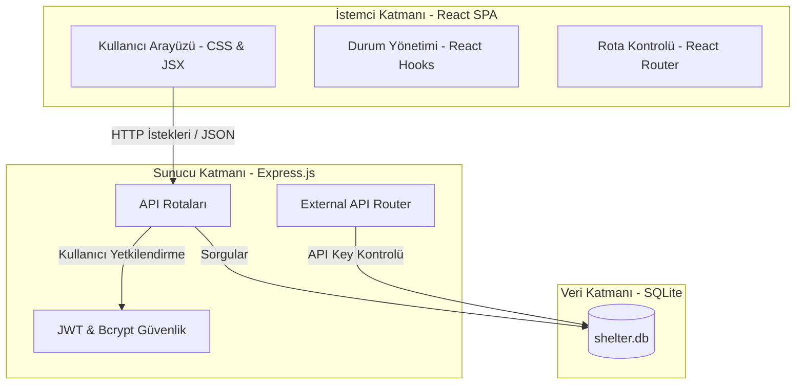
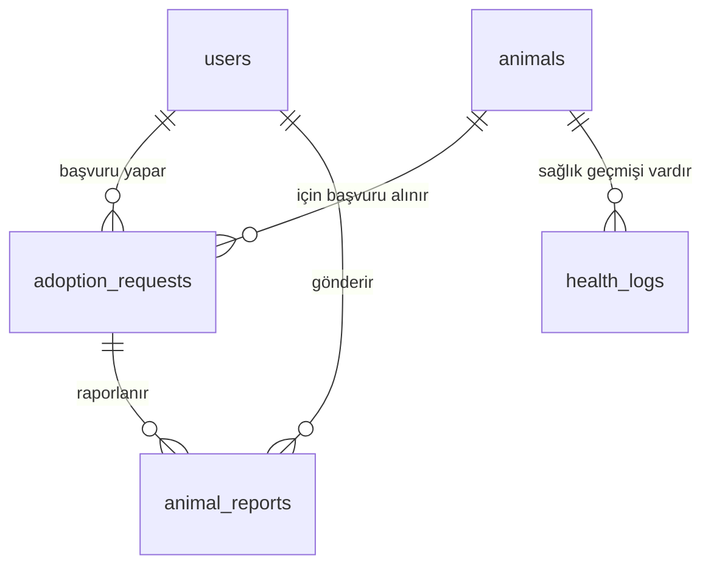

# YAZILIM MİMARİSİ VE TASARIMI DERSİ PROJE RAPORU
## Hayvan Barınağı Yönetim Platformu (PatiHaven)

Bu rapor, Sivas Cumhuriyet Üniversitesi Yazılım Mühendisliği Bölümü Yazılım Mimarisi ve Tasarımı dersi kapsamında geliştirilen **PatiHaven Hayvan Barınağı Yönetim Platformu** projesinin teknik detaylarını, seçilen mimari yaklaşımları ve tasarım kararlarını detaylandırmaktadır.

---

### Bölüm 1: Proje Hakkında Genel Bilgi ve Gereksinimler

**PatiHaven**, bir hayvan barınağının operasyonel süreçlerini dijitalleştirmek, aşı/sağlık geçmişini kayıt altına almak ve hayvan sahiplendirme sürecini şeffaf bir şekilde yönetmek amacıyla tasarlanmış web tabanlı bir otomasyon sistemidir.

#### A. Genel Gereksinimlerin Karşılanma Durumu:
1. **Web Tabanlı Arayüz:** Platform, responsive (mobil uyumlu) modern bir SPA (Single Page Application) olarak tasarlanmıştır.
2. **Kullanıcı Kayıt/Giriş:** JWT (JSON Web Token) altyapısı ile güvenli kullanıcı kayıt ve giriş mekanizması sağlanmıştır.
3. **Dinamik Hayvan Sorgulama:** Arama sayfasında tür, cinsiyet, aşı durumu ve serbest metin arama filtreleriyle ilişkisel veritabanı üzerinden anlık filtreleme yapılabilmektedir.
4. **Sahiplenme Talepleri:** Standart kullanıcılar beğendikleri hayvan için gerekçe belirterek sahiplenme talebi gönderebilmektedir.
5. **Yönetici Değerlendirmesi:** Barınak yetkilileri (admin), gelen başvuruları açıklama notu ekleyerek onaylama veya reddetme yetkisine sahiptir.
6. **Durum Güncelleme:** Başvuru onaylandığında, ilgili hayvanın durumu otomatik olarak `'adopted'` (sahiplendirildi) olarak güncellenir ve diğer bekleyen başvurular otomatik reddedilir.
7. **İstatistikler Paneli:** Yönetici panelinde toplam hayvan, sahiplendirilen hayvan, bekleyen talep ve kullanıcı istatistikleri sunulmaktadır.
8. **Dış API Erişimi:** Üçüncü parti sistemlerin entegrasyonu için API anahtarı (`x-api-key`) korumalı endpoints oluşturulmuştur.

#### B. Entegre Edilen Opsiyonel ve Ekstra Özellikler:
1. **Sahiplenme Geçmişi Sayfası:** Kullanıcıların geçmişteki ve aktif olan tüm sahiplenme başvurularını izleyebileceği görsel bir zaman çizelgesi.
2. **Veteriner Sağlık Günlüğü:** Barınak yetkililerinin her hayvan için ayrıntılı aşı, bakım ve ilaç tedavi günlükleri eklemesini sağlayan yapı.
3. **Kullanıcı Durum Bildirimleri:** Hayvanı sahiplenen kişinin, evdeki durumuna, sağlığına dair barınağa periyodik rapor gönderebilmesi ve bu raporların admin panelinden izlenmesi.
4. **Etkileşimli API Test Konsolu:** Dış API entegrasyonunu kolaylaştırmak amacıyla tarayıcı üzerinden canlı API isteği gönderebilen ve JSON çıktısı sunan Swagger benzeri arayüz.
5. **Dual Tema Sistemi:** HSL tabanlı, göz yormayan Premium karanlık ve aydınlık tema desteği.

---

### Bölüm 2: Seçilen Mimariler ve Karar Gerekçeleri

PatiHaven projesinde **Client-Server (İstemci-Sunucu)** mimarisi ve **Monorepo** proje yapısı tercih edilmiştir.

#### Neden Bu Teknolojileri Seçtik?
1. **Frontend: React.js (Vite)**
   - **Gerekçe:** Sayfa geçişlerinde yenileme ihtiyacını ortadan kaldırarak akıcı bir kullanıcı deneyimi (UX) sunar. Vite sayesinde hızlı geliştirme ve minimum build boyutu elde edilir.
2. **Backend: Node.js (Express.js)**
   - **Gerekçe:** JavaScript tabanlı ekosistem bütünlüğü sağlar. JSON formatındaki verileri asenkron işleme yeteneği sayesinde yüksek performans sunar.
3. **Veritabanı: SQLite**
   - **Gerekçe:** Herhangi bir veritabanı sunucusu kurulumu gerektirmeyen dosya tabanlı bir ilişkisel veritabanıdır. Akademik değerlendirme sürecinde projenin taşınabilirliğini en üst düzeye çıkarır. İlişkisel veri tutarlılığını (Foreign Key) tam olarak sağlar.

---

### Bölüm 3: Veritabanı Şeması (İlişkisel Veri Modeli)

Sistemdeki veriler aşağıdaki tablolarda tutulmaktadır:

1. **users:** Kimlik doğrulama verileri ve roller (`user` veya `admin`).
2. **animals:** Barınaktaki hayvanların biyolojik bilgileri, resim bağlantıları ve sahiplenilme durumları.
3. **adoption_requests:** Kullanıcılar ile hayvanlar arasındaki sahiplenme ilişkileri ve başvurunun akıbeti.
4. **health_logs:** Hayvan detayına eklenen tedavi, aşı ve veteriner kontrollerinin kayıtları.
5. **animal_reports:** Hayvan sahiplenildikten sonra kullanıcının barınağa gönderdiği durum raporları.

---

### Bölüm 4: Kalite Nitelikleri Değerlendirmesi

1. **Taşınabilirlik (Portability):** Veritabanı dosyasının (`shelter.db`) proje dizininde yer alması ve Node.js bağımlılıklarının tek komutla kurulması sayesinde proje her bilgisayarda ek bir ayar yapmadan doğrudan çalıştırılabilir.
2. **Güvenlik (Security):** Parolalar `bcryptjs` kütüphanesi ile tek yönlü tuzlanarak (salt) şifrelenir. Oturum kontrolleri `JWT` token ile yapılır. Dış entegrasyon API'si ise `x-api-key` kontrolü ile yetkisiz erişimden korunmaktadır.
3. **Modülerlik (Modularity):** Sunucu kodları rotalara göre ayrılmıştır (`/routes/auth`, `/routes/animals`, `/routes/adoptions`, `/routes/external`). Bu sayede yeni bir özellik eklenmek istendiğinde diğer modüller etkilenmez.
4. **Değiştirilebilirlik (Modifiability):** CSS değişkenleri HSL tabanlı tanımlandığı için tüm renk şeması tek bir dosyadan değiştirilebilir.
